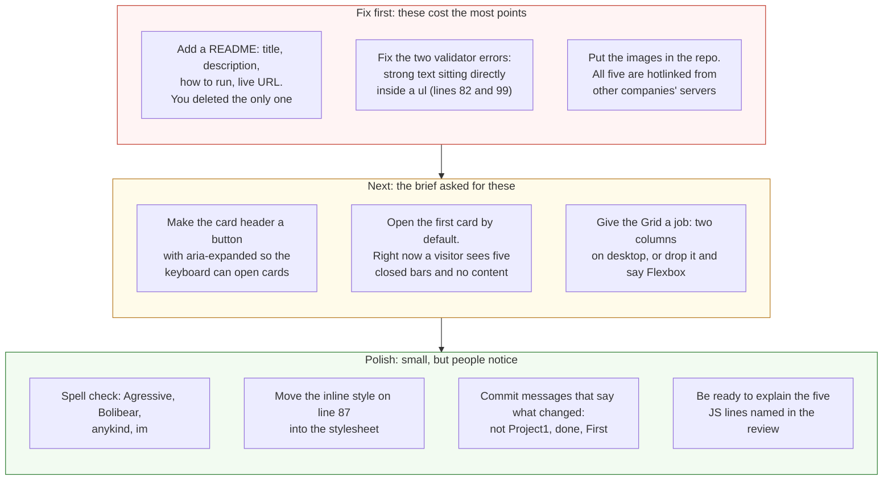

# Project 1: Static Foundations — Feedback

**Student:** Fernando Contreras (Zyokoji) · **Repo:** [Zyokoji/Project1](https://github.com/Zyokoji/Project1) · **Live:** [mysetup1.netlify.app](https://mysetup1.netlify.app/)
**Reviewed at commit:** `0061c1f` · **Course:** CSC 436, Fall 2026

> **How this review was made.** Your instructor reviewed this project with [Claude](https://claude.com) (Anthropic's AI) as a second set of eyes. Claude cloned the repo, read every line, loaded the live site at phone, tablet and desktop widths, ran the W3C validator, clicked every card open and closed, clicked every nav link, and read the Gemini and ChatGPT conversations you shared. Every note and every point below was read and approved by your instructor. Same standard, same rubric, just more time spent looking at *your* code than one human has in a grading week.

## Grade: 75 / 100

| Category | Points | Earned | One line |
|---|:-:|:-:|---|
| Semantic HTML | 20 | 16 | Every element the brief lists is here, one `h1`, clean outline; two validator errors, clickable `div`s |
| CSS layout | 25 | 21 | Flexbox header, nav and card bars are real; the Grid is one column at every width |
| Responsive design | 15 | 12 | No horizontal scroll, header stacks on phones; desktop is the same single column |
| JavaScript interaction | 15 | 12 | Accordion and smooth-scroll both work and are clean; mouse only, no keyboard |
| Repository and deployment | 15 | 8 | Six days of commits, deploy works; the README was deleted and the messages don't say what changed |
| Content and polish | 10 | 6 | Real specs, real games, real you; every image is hotlinked, and the page opens with everything collapsed |
| **Total** | **100** | **75** | **A working, honest site with the rough edges of a first one.** |

## The short version

This is a real page about a real setup, and it works. The skeleton is exactly what the brief listed: `header`, `nav`, `main`, four `section`s, five `article`s, `footer`, one `h1`. The accordion opens and closes, the badge text flips, the nav links scroll smoothly and pop open the right card. No console errors. And your CSS comments say plainly where the AI helped, which is the honesty the brief asks for.

The points came off in the corners. Two validator errors from text sitting directly inside a `ul`. Card headers that only a mouse can open. A Grid that never has more than one column. All five images pulled live from other companies' servers. A README that you wrote, then deleted in the last commit. Commit messages like "done," "First," and "Im SO LOST." And the whole page loads with every card closed, so a first-time visitor sees five bars and no content. Each of these is small. Together they're the difference between 75 and the high 80s.

## What the numbers looked like

Things Claude measured (so you know these aren't guesses):

| Check | Result |
|---|---|
| Horizontal scroll at 375 / 768 / 1280 px | None at any width |
| Console errors | 0 |
| W3C HTML validator | 2 errors: `strong` directly inside `ul` (lines 82 and 99) |
| Heading order | h1 → h2, no skipped levels |
| Semantic elements | `header`, `nav`, `main`, 4 `section`, 5 `article`, `footer` |
| Accordion | All 5 cards open and close; badge text updates |
| Nav links | All 4 scroll to the section and expand its first card |
| Card header element | `div`, not focusable, no `aria-expanded` |
| Grid columns on `main` at 375 / 768 / 1280 | 1 / 1 / 1 |
| Media queries | 1, `max-width: 600px` |
| Images in the repo | 0 of 5 (all hotlinked: futurecdn, riotgames, epicgames, pinimg) |
| README at the graded commit | None (deleted in `0061c1f`) |
| Commits | 7, from Sep 9 to Sep 15 |

---

## Semantic HTML — 16 / 20

**What's working**

- The structure is the textbook answer. `header` holds the `h1` and a `nav` with a real `ul > li > a`. `main` holds four `section`s, each wrapping an `article` with its own `h2`. A `footer` closes it. One `h1`, no skipped levels. `lang`, viewport, `title`. Every image has alt text.

**What to change**

- **Two validator errors.** [Lines 82](https://github.com/Zyokoji/Project1/blob/0061c1f/index.html#L82) and [99](https://github.com/Zyokoji/Project1/blob/0061c1f/index.html#L99) put a `<strong>` paragraph directly inside a `<ul>`. A `ul` may only contain `li`. Move each description into a `<p>` after the list, where it belongs.
- **The card headers are `div`s that you click.** [Line 26](https://github.com/Zyokoji/Project1/blob/0061c1f/index.html#L26) and four more. A `div` can't receive keyboard focus, so someone tabbing through your page can never open a card, and a screen reader announces a heading, not a control. Make the clickable part a `<button>` inside the `h2`, with `aria-expanded` that your JS flips.

  ```mermaid
  flowchart TB
      subgraph now["Now: index.html lines 26 to 29, every card"]
          direction TB
          n1["article.card.toggle-card"] --> n2["<b>div</b>.card-header<br/>click handler attached in JS"]
          n2 --> n3["h2 Computer Specifications"]
          n2 --> n4["span.badge Click to Expand"]
          n1 --> n5["div.card-content<br/>max-height: 0 until .active"]
          n6["Mouse: works.<br/>Keyboard Tab key: skips it.<br/>Screen reader: hears a heading, not a control."]
          n2 -.- n6
      end
      subgraph next["Better: the header is a real button"]
          direction TB
          m1["article.card"] --> m2["h2 > <b>button</b>.card-header<br/>aria-expanded=false<br/>aria-controls=specs-content"]
          m2 --> m3["Computer Specifications"]
          m2 --> m4["span.badge (aria-hidden)"]
          m1 --> m5["div id=specs-content .card-content<br/>hidden until expanded"]
          m6["Mouse, keyboard and screen reader<br/>all get the same control.<br/>JS also flips aria-expanded."]
          m2 -.- m6
      end
      now ==>|"same CSS, same toggle logic,<br/>one tag change per card"| next
      style n2 fill:#fde2e2,stroke:#c0392b,color:#111
      style n6 fill:#fff4d6,stroke:#b7791f,color:#111,stroke-dasharray: 5 5
      style m2 fill:#e3f4e1,stroke:#2e7d32,color:#111
      style m6 fill:#e3f4e1,stroke:#2e7d32,color:#111,stroke-dasharray: 5 5
  ```

- **Inline style** on [line 87](https://github.com/Zyokoji/Project1/blob/0061c1f/index.html#L87): `style="margin-top: 25px;"`. That's a CSS rule living in the HTML. `#games article + article { margin-top: 25px }` in the stylesheet does the same thing and keeps the two files honest.
- Alt text is present but generic: "Peripherals", "Valorant", "Zyokoji." Say what's in the picture: "Mechanical keyboard, mouse and headset on a desk."

## CSS layout — 21 / 25

**What's working**

- **Flexbox, yours, three ways:** the header (`space-between` puts the nav on the right), the nav list, and every card header (title left, badge right) ([First.css L18–39](https://github.com/Zyokoji/Project1/blob/0061c1f/First.css#L18-L39), [L77–83](https://github.com/Zyokoji/Project1/blob/0061c1f/First.css#L77-L83)). Each one is the right tool.
- The theme is consistent: one dark background, one cyan accent, one pink accent, and they're used the same way everywhere. The hover lift and glow on cards, the badge color swap when open, the `max-height` transition on the accordion. It looks like one person designed it.
- The CSS comments that say where AI helped ([L8](https://github.com/Zyokoji/Project1/blob/0061c1f/First.css#L8), [L17](https://github.com/Zyokoji/Project1/blob/0061c1f/First.css#L17)) are exactly what the brief's AI rule asks for. Keep doing that.

**What to change**

- **The Grid is one column at every width.** `main { display: grid; grid-template-columns: 1fr }` ([L53–59](https://github.com/Zyokoji/Project1/blob/0061c1f/First.css#L53-L59)) never has more than one column, so it's a vertical stack with a gap, which `display: block` and margins already do. Flexbox alone satisfies the layout requirement, so no points lost for that, but if you're going to write `display: grid`, give it a job: `repeat(auto-fit, minmax(400px, 1fr))` would put two cards side by side on a desktop.
- **`max-height: 800px` is a guess.** The accordion animates `max-height` from 0 to 800 ([L109–114](https://github.com/Zyokoji/Project1/blob/0061c1f/First.css#L109-L114)). The tallest card is 547px today. Add a longer game description or a second image and the bottom gets clipped with no warning. It works; just know where the cliff is.
- Small: the `.card` has `cursor: pointer` on the whole card, but only the header toggles. Move `cursor: pointer` to `.card-header`.

## Responsive design — 12 / 15

**What's working**

- No horizontal scroll at 375, 768 or 1280. The header stacks its title and nav on phones ([L148–154](https://github.com/Zyokoji/Project1/blob/0061c1f/First.css#L148-L154)). Images are `max-width: 100%`. Text wraps.

**What to change**

- **Desktop is the phone layout with more margin.** One column at every width, capped at 900px. Between the phone and a 27" monitor, the only thing that changes is the header direction. The brief asked the layout to adapt meaningfully. A two-column card grid above 900px, or the About card beside the Specs card, would do it.
- **Desktop-first.** The one media query is `max-width`. The brief asked for mobile-first. Flip it to `min-width: 600px` and let the stacked header be the default.

## JavaScript interaction — 12 / 15

**What's working**

- Two interactions, both real, both verified. The accordion ([First.js L3–18](https://github.com/Zyokoji/Project1/blob/0061c1f/First.js#L3-L18)) uses `classList.toggle`'s return value to set the badge text in one line. The nav handler ([L21–45](https://github.com/Zyokoji/Project1/blob/0061c1f/First.js#L21-L45)) prevents the default jump, scrolls smoothly, and opens the target card so the user lands on content instead of a closed bar. That last touch is thoughtful. Everything is wrapped in `DOMContentLoaded`, uses `addEventListener`, and there are zero console errors.

**What to change**

- **Mouse only.** Because the header is a `div`, nobody using a keyboard can trigger the click. The fix is in the HTML section: a `<button>`. Then add one line to the handler: `header.setAttribute('aria-expanded', isActive)`.
- **The badge logic is written twice.** Lines 14–16 and 40–41 both set the badge text. Pull it into a function, `setOpen(card, isOpen)`, and call it from both places.
- **On the AI conversations you shared.** The ChatGPT thread has you asking it to write the JavaScript ("idk java so i need u to step in"), and the answer was a five-line toggle. What shipped is forty-five lines that do more than that. The brief allows all of this, and your CSS comments are honest about it. The rule that comes with it is that you can explain every line. Be ready to explain these five in office hours: why the code is wrapped in `DOMContentLoaded`; what `classList.toggle` returns; what `e.preventDefault()` stops on [line 25](https://github.com/Zyokoji/Project1/blob/0061c1f/First.js#L25); what the selector `nav a[href^="#"]` matches; and how `max-height` in the CSS makes the card animate.

## Repository and deployment — 8 / 15

**What's working**

- **Seven commits across six days,** September 9 to 15. That's the shape the brief asked for: you didn't do it all the night before. The live site works in a private window and matches the repo.

**What to change**

- **There is no README.** You wrote one on September 14 explaining that you'd lost a repository, and the final commit deleted it. At the graded commit the repo has three files and no README. The brief requires one with the title, a description, how to run it locally, and the live URL. Ten minutes.
- **The commit messages don't say what changed.** "Project1," "done," "Project1," "First," "Im SO LOST." The last one, "Add initial HTML structure for gaming setup page," actually renames `First.html` to `index.html` and deletes the README. Someone reading the log, including you in three months, learns nothing. The brief asked for present-tense messages that name the change: "add expandable cards," "stack header on phones."

  ```mermaid
  flowchart TB
      subgraph yours["Your repo: 7 commits, Sep 9 to Sep 15"]
          direction LR
          a["Sep 9<br/>Project1<br/>+46 lines"] --> b["Sep 10<br/>done<br/>adds MyFirstfix.html"] --> c["Sep 14<br/>Project1<br/>+321: the real build"] --> d["Sep 14<br/>First<br/>copies everything to First.*"] --> e["Sep 14<br/><b>Im SO LOST</b><br/>deletes MyFirst.*"] --> f["Sep 14<br/>adds README explaining<br/>a lost repository"] --> g["Sep 15<br/>Add initial HTML structure<br/>actually: renames First.html<br/>and <b>deletes the README</b>"]
      end
      subgraph brief["What the brief asks for"]
          direction LR
          h["add page skeleton"] --> i["add flexbox header"] --> j["add expandable cards"] --> k["add smooth scroll nav"] --> l["make header stack on phones"] --> m["add README and live URL"]
      end
      yours -.->|"the timeline is right,<br/>the messages and the README are not"| brief
      style a fill:#fff4d6,stroke:#b7791f,color:#111
      style b fill:#fff4d6,stroke:#b7791f,color:#111
      style c fill:#fff4d6,stroke:#b7791f,color:#111
      style d fill:#fff4d6,stroke:#b7791f,color:#111
      style e fill:#fde2e2,stroke:#c0392b,color:#111
      style f fill:#fff4d6,stroke:#b7791f,color:#111
      style g fill:#fde2e2,stroke:#c0392b,color:#111
      style h fill:#e3f4e1,stroke:#2e7d32,color:#111
      style i fill:#e3f4e1,stroke:#2e7d32,color:#111
      style j fill:#e3f4e1,stroke:#2e7d32,color:#111
      style k fill:#e3f4e1,stroke:#2e7d32,color:#111
      style l fill:#e3f4e1,stroke:#2e7d32,color:#111
      style m fill:#e3f4e1,stroke:#2e7d32,color:#111
  ```

- **"Im SO LOST" deleted every file, and the next two commits put them back under new names.** That's what `git mv` is for, and it's also what a commit message is for. When you're stuck, a commit that says "rename MyFirst to First" is worth more than one that says how you feel. Ask in office hours before you delete things.

## Content and polish — 6 / 10

**What's working**

- It's yours: your parts list, your peripherals, your ranks and champions, a paragraph about you in your own voice. No lorem ipsum. The emoji headings fit the theme. The neon palette is consistent.

**What to change**

- **All five images are hotlinked.** The CPU photo is from Tom's Hardware's CDN, the Valorant art from Riot, League from Epic, and the "About Me" picture is a Pinterest image. None are in your repo. Any of those companies can move or delete the file and your page shows a broken icon, and using their bandwidth for your page is generally against their terms. Download them, put them in an `images/` folder, and for the About Me card, use a picture that's actually you or your setup.
- **The page opens with everything closed.** A first-time visitor sees five bars and the words "Click to Expand" five times. Open the Specs card by default (`class="card toggle-card active"` in the HTML and the badge text to match), or show a short intro above the cards, so the page has content before anyone clicks.
- **Spelling.** "Agressive," "Bolibear" (Volibear), "anykind," "im," "ill." A spell check pass takes two minutes and recruiters notice.

---

## Your next three moves



1. **Write the README and put it back.** Four short sections. It's the cheapest points on the sheet.
2. **Fix the two `ul` errors and turn the card headers into buttons.** Twenty minutes, and the page validates and works from a keyboard.
3. **Own your images and open the first card.** Download the pictures, replace the Pinterest one with something that's yours, and let the page show content before the first click.

You said in your About Me that you're new to this and you try your best. The site shows that. The next step is the last pass: run the validator, click through with the keyboard, read your own commit messages, and fix what you find before you submit.

*This PR only adds feedback files. It does not touch your code. Merge it, close it, or just read it, your call. Questions go to office hours or the Brightspace board.*
